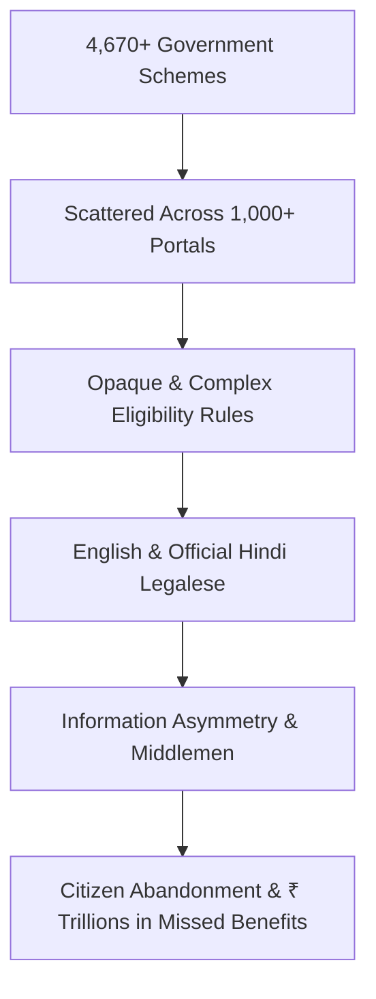
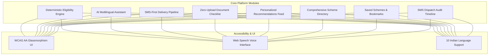
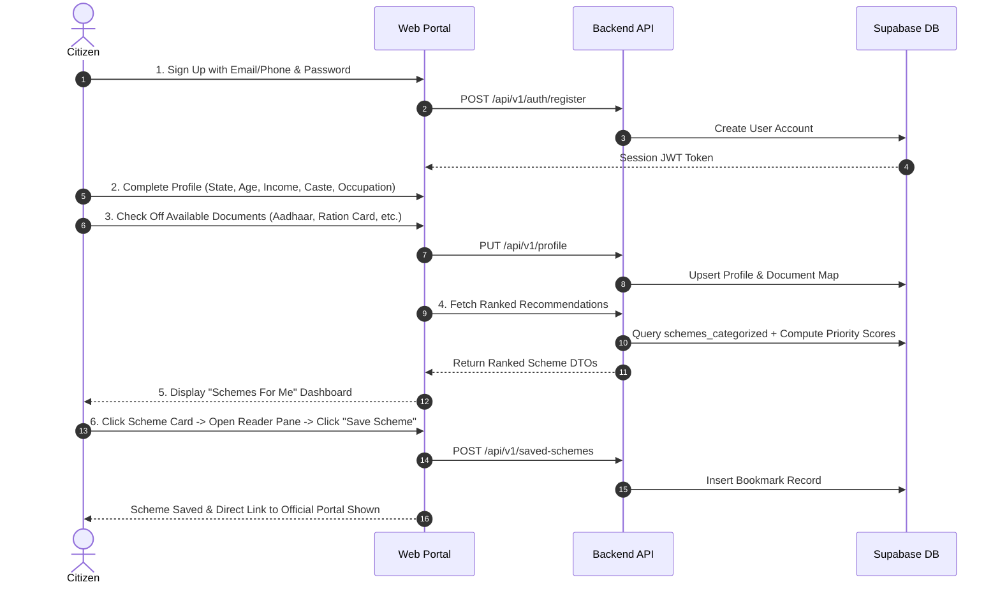
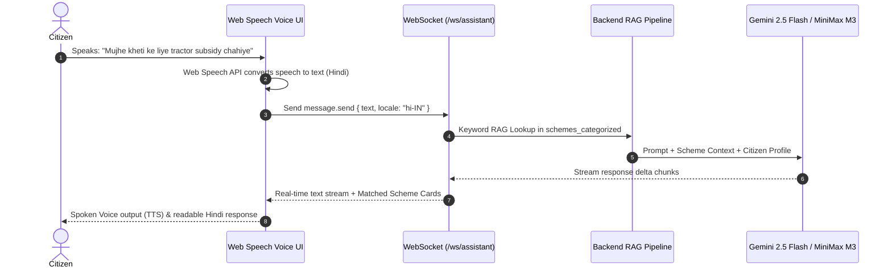
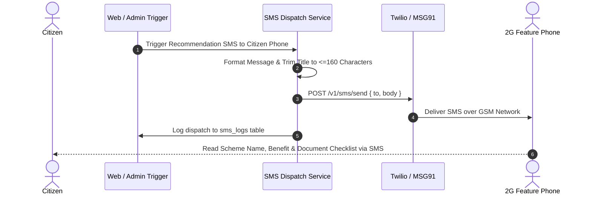
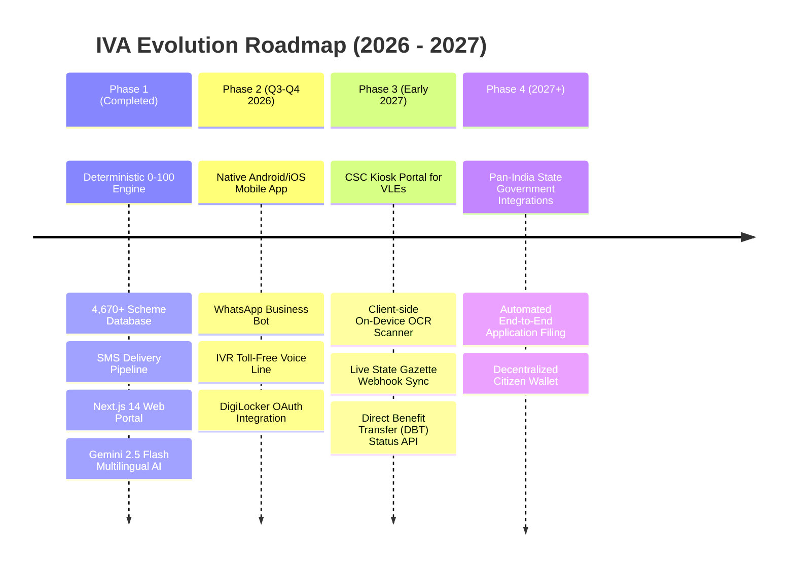

# 🇮🇳 IVA (Intelligent Vanguard Assistant) — Comprehensive Project Guide

> **Tagline:** _Sarkari Yojana, Aasaan Bhasha Mein (Government Schemes, in Simple Language)_  
> **Mission:** _Empowering Every Citizen. Bridging Every Scheme._  
> **Status:** Production-Ready DPI Prototype  
> **Tech Stack:** Next.js 14 · React 18 · TypeScript · Node.js · Supabase (PostgreSQL) · Google Gemini AI / MiniMax M3 · Twilio / MSG91 SMS  

---

## 📑 Table of Contents

1. [Executive Summary & What is IVA?](#1-executive-summary--what-is-iva)
2. [Problem Statement & Background](#2-problem-statement--background)
3. [Targeted Audience & User Personas](#3-targeted-audience--user-personas)
4. [Key Features & Capabilities](#4-key-features--capabilities)
5. [Usage & Step-by-Step User Journeys](#5-usage--step-by-step-user-journeys)
6. [System Architecture & Tech Stack](#6-system-architecture--tech-stack)
7. [Priority Scoring & Eligibility Engine](#7-priority-scoring--eligibility-engine)
8. [Privacy & Security Architecture](#8-privacy--security-architecture)
9. [Current Limitations & Known Constraints](#9-current-limitations--known-constraints)
10. [Future Scope & Strategic Roadmap](#10-future-scope--strategic-roadmap)
11. [Socio-Economic Impact & Conclusion](#11-socio-economic-impact--conclusion)

---

## 1. Executive Summary & What is IVA?

**IVA (Intelligent Vanguard Assistant / Intelligent Welfare Assistance)** is an AI-powered, multilingual **Digital Public Infrastructure (DPI)** platform designed to eliminate information asymmetry and bridge the gap between Indian citizens and **4,670+ Central and State Government welfare schemes**.

India allocates over **₹3,000,000 Crore (~$360 Billion USD)** annually across thousands of welfare programs, subsidies, scholarships, healthcare aids, and farmer benefits. However, over **60% of eligible beneficiaries**—especially in rural areas, farming communities, senior citizens, and low-income households—never discover or successfully apply for the benefits they are legally entitled to receive.

IVA addresses this challenge through a **tri-fold innovation**:
1. **Deterministic Multi-Factor Eligibility Engine**: Evaluates citizen attributes (state, district, age, income range, caste category, occupation, and document availability) with 100% mathematical precision (0–100 match score) rather than unreliable AI guesswork.
2. **Conversational AI in 10 Indian Languages**: Native speech and chat assistance powered by Google Gemini and MiniMax M3, translating complex bureaucratic jargon into simple, actionable guidance.
3. **SMS-First Last-Mile Reach**: Delivers concise scheme summaries, eligibility rationales, and document checklists directly to standard 2G feature phones without requiring an internet connection.

```
┌─────────────────────────┐       ┌───────────────────────────────┐       ┌────────────────────────────┐
│      Indian Citizen     │ ────► │      IVA Core Platform        │ ────► │   Official Scheme Portal   │
│ (Web / Voice / SMS / 2G)│       │ (Deterministic Engine + AI)   │       │   or CSC / Village Center  │
└─────────────────────────┘       └───────────────────────────────┘       └────────────────────────────┘
```

---

## 2. Problem Statement & Background

The welfare delivery ecosystem in India suffers from severe structural bottlenecks at the **discovery phase**:



### The 6 Core Pain Points

1. **Extreme Information Fragmentation**: Schemes are spread across hundreds of central ministry portals, state government websites, and localized district circulars with no unified matching system.
2. **Opaque & Multi-Variable Eligibility Rules**: Criteria often demand complex logical combinations (e.g., *Landholding < 2 hectares AND Annual Family Income < ₹2.5 Lakhs AND SC/ST Category AND Resident of Maharashtra*). Citizens cannot interpret official gazette notifications.
3. **Severe Language & Jargon Barriers**: Over 70% of rural citizens do not read formal English or administrative Hindi.
4. **The Feature Phone & Digital Divide**: Hundreds of millions of rural citizens use basic 2G/3G keypad phones without reliable internet access, rendering desktop-only government portals inaccessible.
5. **Middlemen Exploitation & Corruption**: Due to confusion, citizens rely on unauthorized brokers who charge high commissions (often ₹500 to ₹2,000 or up to 30% of direct cash transfers) simply to fill out basic forms.
6. **Document Confusion & Repeated Trips**: Citizens travel long distances to CSC (Common Service Centre) offices without knowing the exact certificate checklist, leading to repeated rejections and wasted wages.

---

## 3. Targeted Audience & User Personas

IVA is tailored for diverse socio-economic groups across India, specifically targeting those excluded by standard digital platforms:

```
┌─────────────────────────────────────────────────────────────────────────────────────────────────┐
│                                   IVA TARGET BENEFICIARIES                                      │
├───────────────────┬───────────────────┬───────────────────┬───────────────────┬─────────────────┤
│  🌾 Rural Farmers │ 🎓 Students/Youth │ 👩 Women & SHGs   │ 👴 Senior Citizens│ 💼 Unorganized  │
│   & Landowners    │   & Job Seekers   │   & Single Mothers│   & PwD Citizens  │    Gig Workers  │
└───────────────────┴───────────────────┴───────────────────┴───────────────────┴─────────────────┘
```

### 1. Rural Farmers & Agricultural Workers
* **Profile:** Marginal landowners, tenant farmers, dairy producers, and agricultural laborers.
* **Key Needs:** Timely access to crop insurance (PMFBY), input subsidies (PM-Kisan), solar pump schemes (PM-KUSUM), drip irrigation assistance, and seasonal loan waivers before planting deadlines.
* **IVA Solution:** Urgency-weighted notifications; voice query support in local dialects; SMS delivery directly to basic phones.

### 2. Low-Income & BPL Households
* **Profile:** Families with annual incomes below ₹1.5L–₹3L, daily wage earners, and BPL/Antyodaya ration card holders.
* **Key Needs:** Housing assistance (PMAY), subsidized food grains, subsidized electricity, and Ayushman Bharat health cover.
* **IVA Solution:** Zero-cost discovery; simple document readiness checklists without requiring expensive broker assistance.

### 3. Students, Youth & Job Seekers
* **Profile:** High school, undergraduate, vocational, and civil service aspirants from rural/semi-urban areas.
* **Key Needs:** Pre-matric and post-matric scholarships, skill development training (PMKVY), education loans with interest subsidies, and competitive exam fee waivers.
* **IVA Solution:** Instant category/merit filtering; clear application deadlines and official direct links.

### 4. Women & Self-Help Groups (SHGs)
* **Profile:** Rural women, female entrepreneurs, pregnant/lactating mothers, and SHG members.
* **Key Needs:** Maternal nutrition incentives (PMMVY), cooking gas subsidies (PM Ujjwala), Lakhpati Didi microcredit, and girl child educational funds (Sukanya Samriddhi).
* **IVA Solution:** Gender-filtered scheme discovery; step-by-step guidance on required self-declaration documents.

### 5. Senior Citizens & Persons with Disabilities (PwD)
* **Profile:** Individuals aged 60+, retired unorganized workers, and citizens with physical or visual disabilities.
* **Key Needs:** Old-age pensions (IGNOAPS), assistive device grants (ADIP), disability pensions, and specialized medical aids.
* **IVA Solution:** High-contrast accessible UI (WCAG AA compliant); voice-first conversational interaction; zero typing required.

### 6. Common Service Centre (CSC) Operators & Village Volunteers
* **Profile:** Village Level Entrepreneurs (VLEs) operating local digital service kiosks.
* **Key Needs:** Fast, reliable lookup tools to advise visiting villagers on all applicable central and state schemes in under 60 seconds.
* **IVA Solution:** Comprehensive search engine across 4,670+ schemes; instant scheme summaries and exact document requirements to print or dispatch via SMS.

---

## 4. Key Features & Capabilities



### Summary Feature Matrix

| Feature | Description | Technical Implementation | Citizen Impact |
| :--- | :--- | :--- | :--- |
| **Deterministic Eligibility Engine** | Computes a 0–100 match score based on 10+ demographic variables. | TypeScript rule engine + SQL multi-column evaluation (`schemes_categorized`). | Zero hallucinations; clear, explainable match percentages and reasons. |
| **Priority Scoring Pipeline** | Ranks schemes dynamically by Urgency (40%), Eligibility (40%), and Recency (20%). | 180-day linear decay calculation + urgent deadline flags. | Time-sensitive and high-match benefits appear at the top. |
| **Multilingual AI Assistant** | Conversational query assistant answering questions in natural Indic languages. | Google Gemini 2.5 Flash / MiniMax M3 + WebSocket streaming. | Citizens ask in plain language (e.g., _"Mujhe kheti ke liye kaunsi yojana milegi?"_). |
| **Voice-First Interaction** | Hands-free spoken input and voice playback in native languages. | Browser Web Speech API (`SpeechRecognition`) mapped to Indic BCP-47 locales. | Illiterate and elderly citizens interact naturally without typing. |
| **SMS Notification Pipeline** | Formatted scheme summaries and document lists sent directly via SMS. | Twilio / MSG91 integration with automatic 160-character segment trimming. | Works on any basic ₹1,500 feature phone without internet access. |
| **Zero-Upload Privacy Policy** | Verifies document readiness via boolean checkmarks without file storage. | Client state + boolean JSONB mapping (`hasAadhaar: true`). | 100% privacy protection; zero risk of sensitive document leaks. |
| **"Schemes For Me" Dashboard** | Proactive, tailor-made recommendations based on user profile. | Dynamic SQL join + citizen demographic profile filter. | No manual searching; instant personalized view upon login. |
| **Comprehensive Directory (4,670+)** | Searchable database of all Central & State government schemes. | Full-text search + department, state, and category filtering. | Replaces 1,000+ scattered official portals in one unified search. |
| **Dedicated Reader Pane** | Structured scheme reader with separate scrolling and clean document hierarchy. | CSS Grid / Flex layout with sticky search header and reader boundaries. | Clean reading experience on desktop, tablet, and mobile screens. |
| **Saved Schemes Reference** | Bookmark schemes to apply later or share with family members. | Relational `saved_schemes` table with cascade deletion. | Quick offline reference and direct link access to official portals. |
| **SMS History Timeline** | Visual audit log of all SMS messages dispatched to the citizen's phone. | `sms_logs` table with delivery status badges (`Sent`, `Delivered`). | Citizens can review previous SMS recommendations on the web. |
| **Adaptive Dual-Theme UI** | Modern glassmorphism design with responsive light and dark themes. | Design tokens (`tokens.ts`) with CSS custom properties. | High contrast, calm aesthetic reducing eye fatigue. |

---

## 5. Usage & Step-by-Step User Journeys

### Journey A: Web Portal Citizen Journey (Standard Flow)



#### Step Details:
1. **Onboarding:** Register with email/phone. Select preferred language (e.g., Hindi, Gujarati, Tamil).
2. **Profile Setup:** Enter basic demographics (State, District, Age, Gender, Occupation, Caste Category, BPL/Income range).
3. **Document Checklist:** Tick boxes for available certificates (Aadhaar, PAN, Income Certificate, Domicile, Ration Card, Bank Passbook, Caste Certificate, Land Ownership Records).
4. **Explore Matches:** View the **"Schemes For Me"** tab. Every scheme displays an **Eligibility Percentage**, **Match Reasons**, and **Urgency Badges**.
5. **Read & Apply:** Open any scheme in the side reader pane to read detailed benefits, required documents, eligibility rules, and click the **Official Apply Link**.

---

### Journey B: Multilingual Voice & AI Conversational Journey



#### Step Details:
1. Citizen clicks the floating **AI Assistant** or microphone icon.
2. Citizen speaks naturally in their native language (e.g., *"How can I get financial help for my daughter's college education in Karnataka?"*).
3. The browser captures voice locally without uploading raw audio files.
4. The AI streams back a plain-language answer explaining relevant schemes (e.g., *Pragati Scholarship, Sukanya Samriddhi*), eligibility rules, and required documents.

---

### Journey C: Feature Phone / SMS Delivery Journey (Last-Mile Reach)



#### Sample SMS Message:
```text
[IVA Alert] Pradhan Mantri Kisan Samman Nidhi
Benefit: Rs. 6000/yr direct bank transfer.
Docs Needed: Aadhaar, Land Record, Bank Passbook.
Apply at nearest CSC or pmkisan.gov.in
```

---

### Journey D: Common Service Centre (CSC) / Village Kiosk Journey

1. Village Level Entrepreneur (VLE) opens IVA at the local kiosk.
2. VLE enters the visiting villager’s demographic details in under 60 seconds.
3. IVA immediately filters and ranks 10–15 eligible central and state schemes.
4. VLE clicks **"Send SMS"** to dispatch the entire scheme list and document checklist to the farmer's basic phone.
5. Farmer returns with the exact required documents on the same day—preventing repeated trips.

---

## 6. System Architecture & Tech Stack

IVA is architected as an **enterprise TypeScript monorepo** with strict decoupling between UI applications, backend services, and shared contracts.

```
IVA/
├── apps/
│   ├── web/                     # Citizen Web Portal (Next.js 14, React 18, TypeScript)
│   ├── admin/                   # Administrative Panel & Operations
│   └── backend/                 # Node.js API & WebSocket Server (Plain HTTP, no heavyweight framework)
│       └── src/
│           ├── http/            # REST API router & middleware
│           ├── ws/              # Real-time WebSocket assistant (/ws/assistant)
│           ├── modules/         # Domain modules (auth, profile, eligibility, schemes, sms)
│           ├── lib/priority/    # Deterministic Priority Scoring Engine
│           └── lib/twilio/      # SMS Gateway connector
│
├── packages/
│   └── shared/                  # Shared Types, DTOs, i18n & Contracts
│       ├── contracts/           # API request/response DTOs & WS message schemas
│       ├── constants/           # Design tokens, India states/districts data
│       ├── i18n/                # Translation dictionaries for 10 Indic languages
│       └── types/               # TypeScript domain interfaces
│
├── docs/                        # Architecture & Priority Engine specifications
├── ui_assets/                   # High-resolution theme artworks (homebglight / homebgdark)
└── .env                         # Master environment configuration
```

### Detailed Technology Stack

| Layer | Technology | Purpose |
| :--- | :--- | :--- |
| **Frontend Web** | Next.js 14, React 18, TypeScript | High-performance responsive web portal with SSR and client hydration. |
| **Styling & Theme** | Vanilla CSS + Design Tokens (`tokens.ts`) | Zero-runtime CSS bloat, custom glassmorphism, responsive light/dark modes. |
| **Backend API** | Node.js, TypeScript, Native HTTP | Lightweight, non-blocking I/O server handling REST and WebSocket connections. |
| **Real-Time Assistant** | WebSocket (`ws`), Node.js | Low-latency streaming of AI tokens and live conversation states. |
| **AI Intelligence** | Google Gemini 2.5 Flash / MiniMax M3 | Multilingual natural language understanding and Indic conversation synthesis. |
| **Speech Engine** | Browser Web Speech API | Client-side, privacy-preserving speech-to-text across BCP-47 Indic locales. |
| **Database & Auth** | Supabase (PostgreSQL), Supabase Auth | Relational storage with Row-Level Security (RLS) and JWT authentication. |
| **SMS Gateway** | Twilio API / MSG91 API | Multi-channel SMS dispatch with automated character segment trimming. |

---

## 7. Priority Scoring & Eligibility Engine

Unlike black-box AI algorithms, IVA uses a **fully transparent, deterministic 0–100 point scale** to compute scheme rankings.

$$\text{Priority Score} = \min\Big(100, \text{Urgency Points} + \text{Eligibility Points} + \text{Recency Points}\Big)$$

```
                               ┌─────────────────────────────┐
                               │       Candidate Scheme      │
                               └──────────────┬──────────────┘
                                              │
                      ┌───────────────────────┼───────────────────────┐
                      ▼                       ▼                       ▼
            ┌──────────────────┐    ┌──────────────────┐    ┌──────────────────┐
            │   Urgency Pts    │    │  Eligibility Pts │    │   Recency Pts    │
            │   (Max 40 Pts)   │    │   (Max 40 Pts)   │    │   (Max 20 Pts)   │
            └────────┬─────────┘    └────────┬─────────┘    └────────┬─────────┘
                     │                       │                       │
                     │ isUrgent == true ? 40 │ score * 40            │ 180-day decay
                     │ : 0                   │                       │ linear formula
                     │                       │                       │
                     └───────────────────────┼───────────────────────┘
                                              │
                                              ▼
                               ┌─────────────────────────────┐
                               │ Total Priority Score (0-100)│
                               └─────────────────────────────┘
```

### Component Breakdown:

1. **Urgency Points (40% Weight / Max 40 Points):**
   * If `isUrgent === true` (e.g., closing within 15 days, seasonal crop insurance, emergency drought relief), awards **40 points**; otherwise **0 points**.
2. **Eligibility Points (40% Weight / Max 40 Points):**
   * Computed as $\text{EligibilityFraction} \times 40$.
   * A citizen matching 100% of demographic and document requirements receives **40 points**; a 50% partial match receives **20 points**.
3. **Recency Points (20% Weight / Max 20 Points):**
   * Calculated using a linear decay over **180 days (6 months)** since scheme publication:
     $$\text{RecencyPts} = \max\left(0, 20 \times \left(1 - \frac{\text{DaysSincePublished}}{180}\right)\right)$$
   * Ensures new government schemes get immediate visibility before gradually settling into standard priority ranks.

---

## 8. Privacy & Security Architecture

```
┌─────────────────────────────────────────────────────────────────────────────────────────────────┐
│                                   IVA ZERO-RISK PRIVACY PROMISE                                 │
├─────────────────────────────────────────────────────────────────────────────────────────────────┤
│ 🛡️ NO PHYSICAL DOCUMENT UPLOADS                                                                 │
│ IVA never asks citizens to upload scanned PDFs, photos, or photocopies of Aadhaar, PAN,         │
│ income certificates, or land records.                                                           │
│                                                                                                 │
│ 🛡️ BOOLEAN-ONLY READINESS TRACKING                                                              │
│ The platform only stores boolean flags (e.g. hasAadhaar: true) to evaluate eligibility,         │
│ completely eliminating the risk of identity theft or data leaks.                                │
│                                                                                                 │
│ 🛡️ STRICT ROW LEVEL SECURITY (RLS)                                                              │
│ PostgreSQL database enforces isolation: auth.uid() = user_id. Users can only access their       │
│ own profile, saved schemes, and SMS audit logs.                                                 │
│                                                                                                 │
│ 🛡️ CLIENT-SIDE SPEECH RECOGNITION                                                               │
│ Voice audio is processed locally within the citizen's browser using the Web Speech API.         │
│ Raw audio recordings are never sent to or stored on IVA servers.                                │
└─────────────────────────────────────────────────────────────────────────────────────────────────┘
```

---

## 9. Current Limitations & Known Constraints

To maintain engineering transparency, the following current limitations of the prototype are documented:

| Area | Current Limitation | Explanation & Impact | Mitigation / Planned Resolution |
| :--- | :--- | :--- | :--- |
| **Application Submission** | Discovery & guidance only; does not directly submit forms into government databases. | IVA directs citizens to official portals (e.g., `pmkisan.gov.in`) or CSC centers with the required checklist. | Planned Phase 3 API integrations with select state Single Sign-On (SSO) gateways. |
| **Dataset Synchronization** | Semi-automated database updates. | 4,670+ schemes are curated in `schemes_categorized`; sudden policy changes require ingestion script runs. | Building live automated web crawlers and scraping pipelines for official gazette portals. |
| **Feature Phone Interaction** | One-way SMS dispatches only. | Feature phone users receive scheme alerts via SMS, but cannot yet query back via 2-way interactive USSD menus. | Phase 2 roadmap includes an IVR toll-free dial-in number and WhatsApp conversational bot. |
| **Voice Compatibility** | Dependent on browser Web Speech API. | Older mobile browsers or non-Chromium web views may have limited speech recognition support. | Adding fallback audio capture with server-side Whisper/IndicASR models in mobile app. |
| **Telecom Regulations in India** | DLT (Distributed Ledger Technology) registration limits. | High-volume SMS delivery in India requires strict DLT template approvals from telecom operators. | MSG91 pre-approved DLT templates and fallback email/WhatsApp notification channels. |
| **Offline Web Access** | Requires internet connection to load web assets initially. | Citizens without active data packs cannot open the web portal unless previously cached. | PWA offline service workers and upcoming native Android app (`@iva/mobile`). |

---

## 10. Future Scope & Strategic Roadmap



### Strategic Milestone Details:

1. **Native Mobile App (`@iva/mobile`)**:
   * Cross-platform React Native / Expo application designed for budget Android smartphones.
   * Full offline caching of all 4,670+ schemes, push notifications for expiring deadlines, and biometric login.
2. **Two-Way WhatsApp Conversational Bot**:
   * WhatsApp is the primary digital channel for over 500 million Indians.
   * Citizens can send a voice note or message on WhatsApp to receive tailored scheme cards, PDF summaries, and CSC checklists.
3. **Interactive Voice Response (IVR) Toll-Free Gateway**:
   * Non-literate citizens can dial a toll-free number (e.g., `1800-XXX-XXXX`) from any basic keypad phone.
   * An automated IVR agent speaks in the user's regional dialect, asks 3–4 spoken questions, and reads back eligible benefits.
4. **DigiLocker Integration (OAuth 2.0)**:
   * Instant, 1-click verification of certificate availability directly from the citizen's government DigiLocker account.
5. **On-Device AI Document Scanner (OCR)**:
   * Camera-based scanning of physical paper certificates to verify expiration dates, names, and validity without sending documents to cloud servers.
6. **CSC Kiosk Mode & Agent Portal**:
   * Specialized multi-user workflow for Village Level Entrepreneurs (VLEs) managing hundreds of citizen queries per day.

---

## 11. Socio-Economic Impact & Conclusion

```
                                  SOCIO-ECONOMIC IMPACT
┌──────────────────────────────┬──────────────────────────────┬──────────────────────────────┐
│    ₹3,000,000+ CRORE POOL    │     100M+ UNDERSERVED LIVES  │     ₹500 - ₹2,000 SAVED      │
│  Unlocking access to India's │  Empowering farmers, women,  │  Zero middlemen fees per     │
│  vast annual welfare budget. │  students, and senior folks. │  citizen application.        │
└──────────────────────────────┴──────────────────────────────┴──────────────────────────────┘
```

### Social Transformation Metrics

- **Eradicating Middlemen Exploitation:** By offering instant self-discovery and clear document checklists, IVA saves rural families an estimated **₹500 to ₹2,000 per application** in unauthorized broker fees.
- **Raising Welfare Uptake:** Overcoming administrative jargon and discovery friction to help lift welfare utilization from <40% toward universal coverage for registered demographics.
- **Bridging the Bharat Divide:** Bringing government schemes directly to the palms of rural citizens through voice assistance in 10 languages and direct SMS to 2G feature phones.

---

### 🏛️ Founders & Core Team
* **Nistha Leua** — _Co-Founder & Product Lead_ (Multilingual UX, Product Strategy, Citizen Research)
* **Jaydev Arapada** — _Co-Founder & Lead Architect_ (AI Eligibility Engine, Backend Systems, Database & SMS Pipeline)

---

> **IVA** is not just an application; it is a vision for **inclusive Digital Public Infrastructure** ensuring that:  
> **_"No eligible citizen in India ever misses a government benefit due to lack of information, literacy, or language barriers."_**
